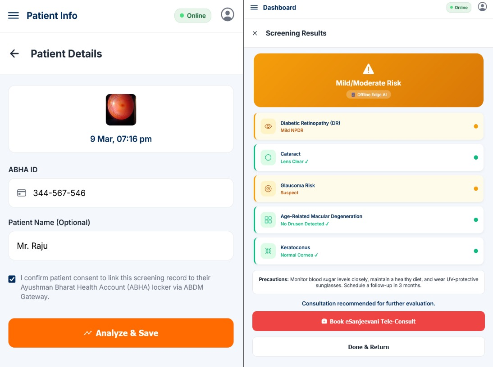

# 👁️ Nayan-Bharat

> Empowering frontline ASHA workers with AI-driven vision health screening for rural communities.

Nayan-Bharat is an innovative, mission-driven Progressive Web Application (PWA) designed to democratize critical eye care. Built specifically for ASHA (Accredited Social Health Activist) workers in remote and under-resourced areas, this tool leverages advanced Edge and Cloud AI to detect early signs of severe visual impairments, including Diabetic Retinopathy, Cataracts, Glaucoma, and more. 

---

## 📸 Screenshots

---

## ✨ Key Features
- 🧠 **Hybrid "Edge-to-Cloud" AI**: Combines ultra-fast, offline-capable Edge AI (quantized MobileNet) for immediate triage with deep-diagnostic Cloud AI (OcuNet v4 via SageMaker) when bandwidth allows.
- 📶 **True Offline-First Architecture**: Built as a PWA using Service Workers and IndexedDB. Health workers can perform complete screenings without an internet connection and sync data seamlessly when back online.
- ⚡ **Lightweight & Blazing Fast**: Engineered with zero frontend framework bloat. The core footprint is < 150KB for near-instant rendering on low-end budget smartphones.
- 🔒 **Enterprise-Grade Security**: Compliant with stringent medical data standards utilizing AWS KMS for at-rest encryption and IAM least-privilege roles for fine-grained access control.

---

## 🛠️ Technology Stack

### Frontend & Client-Side
* **Core**: Vanilla JavaScript (ES6+), HTML5
* **Styling**: Pure CSS (Flexbox & CSS Grid) for optimized, framework-free responsive design.
* **Icons**: Ionicons (dynamically loaded)
* **Edge ML**: TensorFlow.js (WASM/WebGL backend)

### Cloud Infrastructure (AWS Native)
* **Hosting & CDN**: Amazon S3 + Amazon CloudFront
* **API Layer**: Amazon API Gateway
* **Compute**: AWS Lambda (Serverless NodeJS/Python)
* **Authentication**: Amazon Cognito (MFA-enabled for Healthcare data access)
* **Database**: Amazon RDS (PostgreSQL for complex queries & relationships) + Amazon DynamoDB (Session caching)
* **Machine Learning**: Amazon SageMaker (Hosting PyTorch inference endpoints)

---

🧠 AI Model: OcuNet v4
The core diagnostic engine of Nayan Bharat is powered by OcuNet v4, a specialized deep learning model designed for high-accuracy retinal disease screening.

Model Source: OcuNetV4 on Hugging Face, Link: [https://huggingface.co/utkarshhh29/OcuNetV4/tree/main]

Architecture: Built on the EfficientNet-B3 backbone, optimized for medical imaging tasks.

Capabilities: Performs automated detection of Diabetic Retinopathy, Glaucoma, and Cataract from fundus images.

Deployment: Hosted as a live inference endpoint on Amazon SageMaker (ml.m5.large) for real-time analysis.

---

## 🚀 Performance Highlights

Performance is treated as a feature, not an afterthought:
* **Initial Load**: Core HTML/CSS/JS payload is incredibly light, achieving Time-to-Interactive (TTI) in under 1.5 seconds on a 3G mobile connection.
* **Real-Time Inference**: TensorFlow.js executes classification locally in ~300ms on modern devices, without blocking the UI rendering thread.
* **Bandwidth Optimization**: The application dynamically resizes and compresses captured images via an HTML5 Canvas before uploading to the SageMaker API, saving significant data costs for ASHA workers.

---

## 🏗️ Architecture: The Hybrid AI Approach

The architecture is designed to fail gracefully. 
- **Offline Environment**: The ASHA worker captures an image. The local TensorFlow.js model immediately analyzes the frame. If the risk is high, a triage alert is visibly flagged, and the data is stored locally.
- **Online Sync**: Upon reconnecting to Wi-Fi/4G, the application securely uploads the image payloads via API Gateway to an S3 bucket (encrypted with KMS). An event trigger invokes the SageMaker OcuNet model, which updates the RDS PostgreSQL database with the high-confidence clinical diagnosis.

---

## 🛡️ Security & Privacy

Handling medical data requires uncompromising security:
- **At-Rest Encryption**: All fundus/eye images are stored in Amazon S3, utilizing Server-Side Encryption (SSE-KMS) governed by dedicated AWS Key Management Service keys.
- **In-Transit Encryption**: All traffic is enforced over HTTPS via CloudFront and API Gateway.
- **Access Control**: A strict AWS IAM least-privilege model ensures that Lambda functions can only access the specific S3 objects and invoke the exact SageMaker endpoints required for their task. 
- **Identity**: Identity management is governed by Amazon Cognito, restricting system access solely to authenticated and verified ASHA worker IDs.

[def]: <WhatsApp Image 2026-03-09 at 10.01.20 PM.jpeg>
