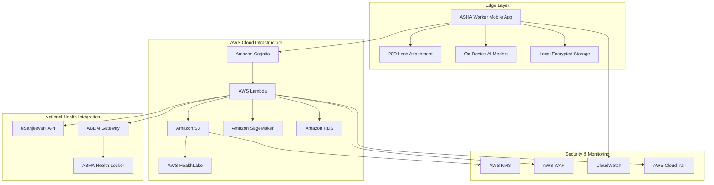

# Design Document: Nayan-Bharat

## Overview

Nayan-Bharat is a comprehensive AI-powered eye screening platform designed to democratize access to Diabetic Retinopathy (DR) and Cataract detection across India. The system leverages edge AI for real-time inference, AWS cloud infrastructure for scalable data management, and seamless integration with India's national health ecosystem including eSanjeevani and ABDM.

The architecture follows a hybrid edge-cloud approach where critical AI inference happens on-device for immediate results, while cloud services handle data synchronization, population health analytics, tele-consultation orchestration, and continuous model improvement.

## Architecture

### High-Level System Architecture



### Edge Computing Layer

**Mobile Application Architecture:**
- **Framework**: React Native for cross-platform compatibility
- **AI Runtime**: TensorFlow Lite for on-device inference
- **Camera Integration**: Custom camera module with 20D lens calibration
- **Local Storage**: SQLite with SQLCipher for encrypted data storage
- **Sync Engine**: Background service for cloud synchronization

**On-Device AI Pipeline:**
- **Image Preprocessing**: Real-time quality assessment and enhancement
- **DR Detection Model**: Quantized CNN model (MobileNetV3 backbone) for severity classification
- **Cataract Detection Model**: Specialized model for lens opacity assessment
- **Quality Control**: Motion blur, illumination, and focus validation models

### AWS Cloud Architecture

**Compute Layer:**
- **API Gateway**: RESTful API endpoints with AWS WAF protection
- **AWS Lambda**: Serverless functions for API orchestration, data processing, and integration
- **Amazon ECS**: Containerized services for batch processing and model training workflows
- **Auto Scaling**: Dynamic scaling based on demand patterns

**Storage Layer:**
- **Amazon S3**: Primary storage for fundus images with lifecycle policies
  - Standard tier for recent images (0-30 days)
  - Infrequent Access for older images (30-365 days)
  - Glacier for long-term archival (>365 days)
- **Amazon RDS**: PostgreSQL for structured data (user profiles, screening records, appointments)
- **Amazon DynamoDB**: Session management and real-time data caching
- **AWS HealthLake**: FHIR-compliant health data lake for population analytics

**AI/ML Infrastructure:**
- **Amazon SageMaker**: Model training, hyperparameter tuning, and deployment
- **SageMaker Edge**: Model deployment and management for edge devices
- **Amazon Rekognition**: Additional image analysis capabilities
- **AWS Batch**: Large-scale batch processing for model training

## Components and Interfaces

### Mobile Application Components

**CameraController**
```typescript
interface CameraController {
  initializeCamera(): Promise<void>
  captureImage(): Promise<FundusImage>
  validateImageQuality(image: FundusImage): QualityMetrics
  provideCaptureGuidance(): GuidanceInstructions
}
```

**AIInferenceEngine**
```typescript
interface AIInferenceEngine {
  loadModels(): Promise<void>
  detectDR(image: FundusImage): Promise<DRResult>
  detectCataract(image: FundusImage): Promise<CataractResult>
  validateImageQuality(image: FundusImage): Promise<QualityResult>
}
```

**DataSyncManager**
```typescript
interface DataSyncManager {
  queueForSync(data: ScreeningData): void
  syncToCloud(): Promise<SyncResult>
  handleOfflineMode(): void
  retryFailedUploads(): Promise<void>
}
```

### Cloud Service Components

**ScreeningService**
```typescript
interface ScreeningService {
  processScreeningData(data: ScreeningData): Promise<ProcessingResult>
  generateReport(screeningId: string): Promise<ScreeningReport>
  updateScreeningStatus(screeningId: string, status: ScreeningStatus): Promise<void>
}
```

**ReferralService**
```typescript
interface ReferralService {
  createReferral(screeningId: string, severity: Severity): Promise<Referral>
  bookTeleConsultation(referralId: string): Promise<Appointment>
  notifyPatient(appointment: Appointment): Promise<void>
}
```

**AnalyticsService**
```typescript
interface AnalyticsService {
  aggregateScreeningData(filters: AnalyticsFilters): Promise<AnalyticsReport>
  generatePopulationInsights(region: Region): Promise<PopulationInsights>
  detectAnomalies(data: ScreeningData[]): Promise<Anomaly[]>
}
```

### Integration Interfaces

**eSanjeevaniIntegration**
```typescript
interface eSanjeevaniIntegration {
  checkDoctorAvailability(specialty: Specialty, location: Location): Promise<Doctor[]>
  bookAppointment(doctorId: string, patientData: PatientData): Promise<Appointment>
  shareScreeningData(appointmentId: string, screeningData: ScreeningData): Promise<void>
}
```

**ABDMIntegration**
```typescript
interface ABDMIntegration {
  validateABHAId(abhaId: string): Promise<ValidationResult>
  linkHealthRecord(abhaId: string, screeningData: ScreeningData): Promise<void>
  retrievePatientConsent(abhaId: string): Promise<ConsentStatus>
}
```

## Data Models

### Core Data Structures

**FundusImage**
```typescript
interface FundusImage {
  id: string
  patientId: string
  ashaWorkerId: string
  imageData: Uint8Array
  metadata: ImageMetadata
  captureTimestamp: Date
  qualityMetrics: QualityMetrics
  processingStatus: ProcessingStatus
}

interface ImageMetadata {
  resolution: Resolution
  deviceInfo: DeviceInfo
  cameraSettings: CameraSettings
  locationData?: LocationData
}
```

**ScreeningResult**
```typescript
interface ScreeningResult {
  id: string
  patientId: string
  imageId: string
  drResult: DRResult
  cataractResult: CataractResult
  overallRisk: RiskLevel
  recommendations: Recommendation[]
  confidence: ConfidenceScores
  processingTimestamp: Date
}

interface DRResult {
  severity: DRSeverity // None, Mild, Moderate, Severe
  confidence: number
  affectedAreas: RetinalRegion[]
  requiresReferral: boolean
}

interface CataractResult {
  presence: boolean
  severity: CataractSeverity // None, Mild, Moderate, Severe
  confidence: number
  lensOpacity: OpacityMeasurement
  requiresReferral: boolean
}
```

**PatientRecord**
```typescript
interface PatientRecord {
  id: string
  abhaId?: string
  demographics: Demographics
  medicalHistory: MedicalHistory
  screeningHistory: ScreeningResult[]
  consentStatus: ConsentRecord
  createdAt: Date
  updatedAt: Date
}

interface Demographics {
  age: number
  gender: Gender
  location: LocationData
  contactInfo: ContactInfo
  preferredLanguage: Language
}
```

### Database Schema

**PostgreSQL Tables:**
- `patients`: Patient demographic and contact information
- `asha_workers`: ASHA worker profiles and authentication data
- `screenings`: Screening session metadata and results
- `referrals`: Referral tracking and appointment management
- `audit_logs`: System access and modification logs

**DynamoDB Tables:**
- `user_sessions`: Active user sessions and authentication tokens
- `sync_queue`: Offline data synchronization queue
- `real_time_metrics`: Live system performance metrics

## Correctness Properties

*A property is a characteristic or behavior that should hold true across all valid executions of a system—essentially, a formal statement about what the system should do. Properties serve as the bridge between human-readable specifications and machine-verifiable correctness guarantees.*

Before defining the correctness properties, I need to analyze the acceptance criteria from the requirements to determine which ones are testable as properties.

### Property 1: Image Quality Validation and Processing Performance
*For any* captured fundus image, the system should validate image quality parameters within 2 seconds and process it for DR and Cataract detection within 10 seconds if quality is acceptable.
**Validates: Requirements 1.4, 2.1**

### Property 2: Automatic Referral Generation
*For any* AI screening result with Moderate or Severe DR classification, the system should automatically flag the case for urgent referral and create an appointment request in eSanjeevani.
**Validates: Requirements 2.3, 6.4**

### Property 3: Offline Data Integrity and Synchronization
*For any* screening data generated while in Low_Connectivity_Mode, the data should be stored locally with encryption, and when connectivity is restored, all local data should be queued for synchronization without data loss.
**Validates: Requirements 3.1, 3.3, 3.5**

### Property 4: Data Format Compliance
*For any* generated patient report or stored fundus image, the data should conform to the specified standards (FHIR R4 for reports, DICOM for images) and include all required metadata fields.
**Validates: Requirements 1.5, 6.2**

### Property 5: Authentication and Security Enforcement
*For any* user authentication attempt, the system should use Amazon Cognito with MFA, encrypt all data at rest with AWS KMS, and encrypt all data in transit with TLS 1.3 or higher.
**Validates: Requirements 4.1, 4.2, 5.1**

### Property 6: Session Management and Security Lockout
*For any* user session, the system should automatically timeout after 30 minutes of inactivity, and after three failed authentication attempts, the account should be temporarily locked with administrator notification.
**Validates: Requirements 5.2, 5.3**

### Property 7: ABHA Integration and Consent Management
*For any* patient with an ABHA_ID, when screening data is generated, the system should link the report to their national digital health locker via ABDM_Gateway and maintain proper consent records.
**Validates: Requirements 6.1, 6.5**

### Property 8: Triage Result Completeness
*For any* processed fundus image, the AI_Inference_Engine should generate complete Triage_Results including confidence scores for both DR severity classification and Cataract presence detection.
**Validates: Requirements 2.2**

### Property 9: Population Health Data Aggregation
*For any* screening data stored in the system, it should be properly anonymized and aggregated in AWS HealthLake, and when generating population reports, they should include district-wise and state-wise prevalence statistics.
**Validates: Requirements 8.1, 8.2**

### Property 10: Model Training Pipeline Integration
*For any* new validated screening data or ground truth data from specialist reviews, the system should automatically incorporate it into the Amazon SageMaker training pipeline for continuous model improvement.
**Validates: Requirements 10.1, 10.5**

## Error Handling

### Image Quality and Capture Errors
- **Motion Blur Detection**: Real-time analysis during capture with immediate feedback
- **Illumination Issues**: Automatic adjustment recommendations and manual override options
- **Focus Problems**: Depth-of-field validation with guided recapture instructions
- **Alignment Errors**: Visual guidance system with real-time pupil tracking

### Network and Connectivity Errors
- **Offline Mode Activation**: Automatic detection of connectivity loss with seamless transition
- **Sync Failures**: Exponential backoff retry mechanism with persistent queue management
- **Partial Upload Recovery**: Resume interrupted uploads from last successful chunk
- **Data Corruption Detection**: Checksum validation for all synchronized data

### AI Model and Processing Errors
- **Model Loading Failures**: Fallback to cached models with degraded functionality alerts
- **Inference Timeouts**: Graceful handling with retry mechanisms and user notification
- **Confidence Threshold Violations**: Clear indication when AI confidence is below acceptable levels
- **Model Version Mismatches**: Automatic model updates with rollback capabilities

### Integration and External Service Errors
- **eSanjeevani API Failures**: Graceful degradation with manual referral options
- **ABDM Gateway Timeouts**: Retry mechanisms with offline consent tracking
- **AWS Service Outages**: Local caching and delayed synchronization strategies
- **Authentication Service Failures**: Emergency access protocols for critical situations

## Testing Strategy

### Dual Testing Approach

The Nayan-Bharat system requires comprehensive testing using both unit tests and property-based tests to ensure reliability in critical healthcare scenarios.

**Unit Testing Focus:**
- Specific edge cases for image quality validation
- Integration points between mobile app and cloud services
- Error conditions and recovery mechanisms
- Authentication and authorization workflows
- API endpoint validation with mock services

**Property-Based Testing Focus:**
- Universal properties that must hold across all screening scenarios
- Data integrity during offline/online transitions
- Security and encryption compliance across all data flows
- Performance characteristics under varying load conditions
- AI model consistency across different input variations

### Property-Based Testing Configuration

**Testing Framework**: 
- **Mobile (React Native)**: fast-check for JavaScript/TypeScript property testing
- **Backend (Python/Node.js)**: Hypothesis (Python) or fast-check (Node.js)
- **Minimum Iterations**: 100 per property test to account for randomization
- **Test Tagging**: Each property test must reference its design document property

**Tag Format**: `Feature: nayan-bharat, Property {number}: {property_text}`

**Critical Testing Areas:**
1. **Image Processing Pipeline**: Validate that all image quality checks and AI inference operations maintain consistency
2. **Data Synchronization**: Ensure offline-to-online data transitions preserve integrity
3. **Security Compliance**: Verify encryption and access control properties across all scenarios
4. **Integration Reliability**: Test external service integration resilience and fallback mechanisms
5. **Performance Boundaries**: Validate timing requirements under various system loads

### Test Data Management

**Synthetic Data Generation**: 
- Fundus image simulation for various DR and Cataract severities
- Patient demographic data generation following Indian population distributions
- ASHA worker profile simulation for different geographic regions

**Privacy-Compliant Testing**:
- All test data must be synthetic or properly anonymized
- No real patient data in development or testing environments
- Compliance with healthcare data protection regulations

### Continuous Testing Integration

**CI/CD Pipeline Integration**:
- Automated property test execution on every code commit
- Performance regression testing for critical user journeys
- Security vulnerability scanning for all dependencies
- Model accuracy validation against benchmark datasets

**Production Monitoring**:
- Real-time property validation in production environment
- Anomaly detection for performance and accuracy metrics
- Automated alerting for property violations or system degradation